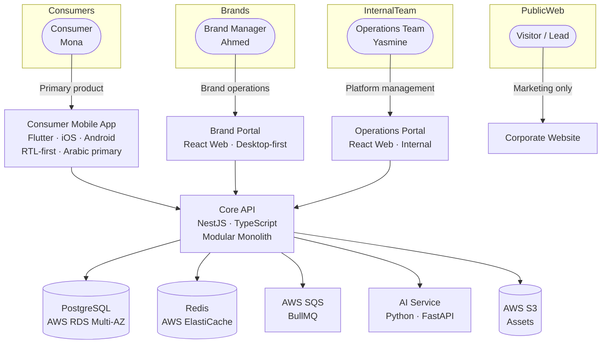
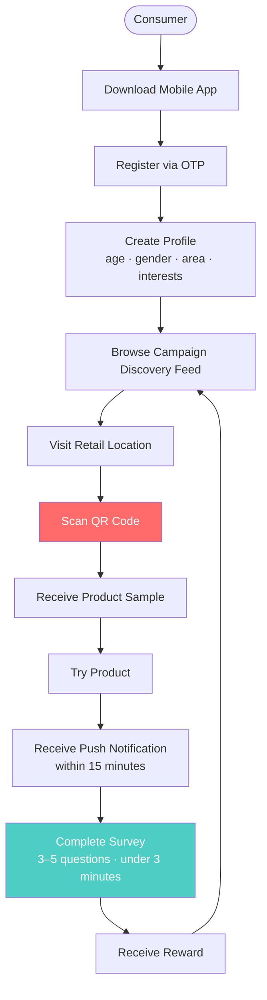

# PROJECT ARCHITECTURE CONSTITUTION
## Tajribti — Consumer Intelligence Platform

---

**Document ID:** PAC-v1.0  
**Status:** CONSTITUTIONAL — LOCKED  
**Authority:** Founder · Project Director  
**Effective Date:** 2026-07-27  
**Applies From:** Post-Track-0-GO (engineering authorization required before any implementation)  
**Does NOT Authorize:** Engineering · Implementation · Production Code · Infrastructure

---

## TABLE OF CONTENTS

1. [Purpose and Scope](#1-purpose-and-scope)
2. [Version History](#2-version-history)
3. [Authority Chain](#3-authority-chain)
4. [Commercial Phase Status](#4-commercial-phase-status)
5. [Platform Architecture Overview](#5-platform-architecture-overview)
6. [Software Products](#6-software-products)
7. [Corporate Website](#7-corporate-website)
8. [Consumer Journey](#8-consumer-journey)
9. [Constitutional Decisions](#9-constitutional-decisions)
10. [Mandatory Prohibitions](#10-mandatory-prohibitions)
11. [Architecture Review Checklist](#11-architecture-review-checklist)
12. [Repository Reference Map](#12-repository-reference-map)
13. [Future Engineering Notes](#13-future-engineering-notes)
14. [Constitutional Audit Record](#14-constitutional-audit-record)

---

## 1. PURPOSE AND SCOPE

This document is the constitutional record of the Tajribti platform architecture.

It defines what the platform IS, what each product OWNS, what each product is PROHIBITED from doing, and how every future architectural decision must be evaluated.

**This document does NOT:**
- Authorize software implementation
- Authorize engineering sprints
- Override Founder Decisions
- Override AI_BOOTSTRAP
- Override locked repository decisions

**This document DOES:**
- Define immutable product boundaries
- Prevent architectural drift during and after Track 0
- Provide a reference standard for all future PRDs, epics, and feature decisions
- Establish a repeatable review checklist for all post-GO engineering proposals

Engineering begins ONLY after the Founder officially authorizes it by closing Track 0 with a written GO decision.

*Source: `AI_BOOTSTRAP/02_PROJECT_STATE.md` — Authorization Status; `AI_BOOTSTRAP/11_AI_RULES.md` RULE-AI-03; `15_Decisions/FOUNDER_DECISIONS.md` BD-13*

---

## 2. VERSION HISTORY

| Version | Date | Author | Change |
|---|---|---|---|
| 1.0 | 2026-07-27 | Founder + Project Director | Initial constitutional draft. All decisions cross-referenced to locked repository decisions. |

---

## 3. AUTHORITY CHAIN

The following hierarchy governs all architectural decisions. Nothing lower may override anything higher.

```
LEVEL 1 — Founder Decisions
         15_Decisions/FOUNDER_DECISIONS.md
         AI_BOOTSTRAP/03_FOUNDER_DECISIONS.md
         ↓
LEVEL 2 — Investment Committee Decisions
         04_Investment/INVESTMENT_DUE_DILIGENCE_REPORT_v2.md
         04_Investment/IC_MEMO_v1.0.md
         ↓
LEVEL 3 — Master PRD
         08_PRD/MASTER_PRD_v1.0.md
         ↓
LEVEL 4 — Technical Architecture
         09_Technical/TECHNICAL_ARCHITECTURE.md
         ↓
LEVEL 5 — This Constitution
         docs/governance/PROJECT_ARCHITECTURE_CONSTITUTION.md
         ↓
LEVEL 6 — All Other Documents
         PRDs, Epics, User Stories, Sprint Plans, ADRs
```

**Conflict resolution rule:** When any two documents conflict, the higher-authority document governs. If the conflict is between documents at the same level, STOP and report to the Founder.

*Source: `AI_BOOTSTRAP/11_AI_RULES.md` Section 3 — Conflict Resolution*

---

## 4. COMMERCIAL PHASE STATUS

```
CURRENT PHASE:    Track 0 — Commercial Validation
AUTHORIZATION:    Commercial activities ONLY
ENGINEERING:      NOT AUTHORIZED
IMPLEMENTATION:   NOT AUTHORIZED
PRODUCTION CODE:  NOT AUTHORIZED
```

**All sections of this constitution describing product implementation apply ONLY after the Founder issues a written Track 0 GO decision.**

Until that decision:
- RULE-AI-03 remains active
- AI_BOOTSTRAP restrictions remain active
- This constitution defines future intent, not current authorization

*Source: `AI_BOOTSTRAP/02_PROJECT_STATE.md`; `15_Decisions/FOUNDER_DECISIONS.md` BD-13, REM-04*

---

## 5. PLATFORM ARCHITECTURE OVERVIEW

### 5.1 System Diagram



### 5.2 Product-to-User Mapping

| Product | Primary User | Persona | Technology |
|---|---|---|---|
| Consumer Mobile App | Egyptian consumer | Mona | Flutter (iOS + Android) |
| Brand Portal | Marketing Director / Brand Manager / Consumer Insights | Ahmed | React Web |
| Operations Portal | Internal Tajribti team | Yasmine | React Web |
| Corporate Website | Visitors / Leads / Investors | — | TBD (marketing infra) |

*Source: `08_PRD/MASTER_PRD_v1.0.md` PD-04; `15_Decisions/FOUNDER_DECISIONS.md` TD-01, TD-02, TD-03; `AI_BOOTSTRAP/08_ARCHITECTURE_MAP.md`*

---

## 6. SOFTWARE PRODUCTS

### 6.1 Consumer Mobile Application

**Constitutional ID:** CAD-01  
**Technology:** Flutter (cross-platform iOS + Android)  
**Status:** PRIMARY PRODUCT

```
The Consumer Mobile App is the core product.
All consumer-facing functionality belongs exclusively here.
No other product may own or duplicate consumer interactions.
```

**Ownership — Features and Capabilities:**

| Feature | PRD Reference | Priority |
|---|---|---|
| OTP Registration and Authentication | TJ-001 | P0 |
| Consumer Profile and Onboarding | TJ-002 | P0 |
| Consent Center (PDPL-compliant) | TJ-003 | P0 |
| Campaign Discovery Feed | TJ-004 | P0 |
| QR Code Redemption | TJ-005 | P0 — HIGHEST RISK |
| Post-Trial Survey (3–5 questions, <3 min) | TJ-006 | P0 |
| Push Notifications | TJ-007 | P0 |
| Consent and Privacy Center | TJ-008 | P0 |
| Gamification and Rewards Engine | TJ-019 | P0 |
| Consumer Wallet | TJ-019 | P1 |
| Referral Program | — | P1 |
| Consumer History | — | P1 |
| In-App Support | — | P1 |

**Design Standards:**

| Standard | Decision | Source |
|---|---|---|
| Language | Arabic primary, English secondary | UX-02 LOCKED |
| Direction | RTL-first | UX-01 LOCKED |
| Authentication | OTP only — no email/password | UX-03 LOCKED |
| Survey length | Maximum 3–5 questions, <3 minutes | UX-05 LOCKED |
| Target devices | iOS 14+ · Android 6+ · lower-end Android | TD-01 LOCKED |

*Source: `15_Decisions/FOUNDER_DECISIONS.md` TD-01, PD-01, PD-02; `08_PRD/MASTER_PRD_v1.0.md`*

---

### 6.2 Brand Portal

**Constitutional ID:** CAD-02  
**Technology:** React Web — Desktop-first  
**Users:** Marketing Directors · Brand Managers · Consumer Insights Teams

```
The Brand Portal owns all brand-side operations.
No consumer journey flows belong here.
No operations or admin functions belong here.
```

**Ownership — Features and Capabilities:**

| Feature | PRD Reference | Priority |
|---|---|---|
| Brand Account Management | TJ-009 | P0 |
| Campaign Creation Wizard | TJ-010 | P0 |
| Live Campaign Monitoring | TJ-012 | P0 |
| Consumer Intelligence Reports | TJ-011 | P0 |
| Analytics and ROI Reporting | — | P0 |
| Data Exports (CSV, PDF) | — | P1 |
| Pilot Monitoring Dashboard | — | P1 |
| AI Insight Narratives | TJ-018 | P2 — DEFERRED TO V2 |

**Design Standards:**

| Standard | Decision | Source |
|---|---|---|
| Layout | Desktop-first | UX-04 LOCKED |
| Authentication | OTP or OAuth2 | TD-09 LOCKED |

*Source: `15_Decisions/FOUNDER_DECISIONS.md` TD-02, PD-01; `08_PRD/MASTER_PRD_v1.0.md`*

---

### 6.3 Operations Portal

**Constitutional ID:** CAD-03  
**Technology:** React Web — Internal  
**Users:** Internal Tajribti Operations Team

```
The Operations Portal owns all internal platform management.
It is not accessible to brands or consumers.
No brand-facing features belong here.
```

**Ownership — Features and Capabilities:**

| Feature | PRD Reference | Priority |
|---|---|---|
| Campaign Approvals | TJ-017 | P0 |
| Fraud Detection and Review | TJ-021 | P0 (manual) → P1 (automated) |
| Retail Location Management | — | P0 |
| Consumer Support | — | P1 |
| Brand Account Administration | — | P1 |
| Platform Audit and Logs | — | P1 |
| Field Coordinator Management | — | P1 |

*Source: `15_Decisions/FOUNDER_DECISIONS.md` TD-03, PD-01; `08_PRD/MASTER_PRD_v1.0.md`*

---

## 7. CORPORATE WEBSITE

**Constitutional ID:** CAD-04  
**Status:** Marketing infrastructure — NOT a software product  
**Purpose:** Marketing only

```
The Corporate Website is not a software product.
It does not host the consumer experience.
It does not host the brand experience.
It exists solely to acquire leads and present company information.
```

**Permitted Content:**

| Content Type | Permitted |
|---|---|
| Landing pages | Yes |
| Company information | Yes |
| Pricing page | Yes |
| Demo booking | Yes |
| Contact forms | Yes |
| Blog / SEO content | Yes |
| Careers | Yes |
| Investor information | Yes |
| Legal pages (Privacy Policy, Terms) | Yes |

**Prohibited Content:**

| Content Type | Prohibited | Reason |
|---|---|---|
| Consumer registration | PROHIBITED | Belongs to Mobile App (CAD-01) |
| Consumer surveys | PROHIBITED | Belongs to Mobile App (CAD-01) |
| QR scanning | PROHIBITED | Belongs to Mobile App (CAD-01) |
| Rewards or wallet | PROHIBITED | Belongs to Mobile App (CAD-01) |
| Brand campaign management | PROHIBITED | Belongs to Brand Portal (CAD-02) |
| Consumer intelligence reports | PROHIBITED | Belongs to Brand Portal (CAD-02) |
| Any operational function | PROHIBITED | Belongs to Operations Portal (CAD-03) |

---

## 8. CONSUMER JOURNEY

**Constitutional ID:** CAD-05  
**Status:** LOCKED  
**Owner:** Consumer Mobile Application exclusively

Every feature proposed in any future sprint must be evaluated against this journey. Features that do not strengthen this journey require explicit Founder authorization.



> **TJ-005 (QR Code Redemption) — Highest Technical Risk**  
> Concurrent scan race condition must be resolved before beta. Design: RESERVED state with 5-minute TTL, database-level unique constraint, SQS-based decoupling. Load test (B-04) is required before GO.  
> *Source: `08_PRD/MASTER_PRD_v1.0.md` TJ-005; `09_Technical/TECHNICAL_ARCHITECTURE.md`*

---

## 9. CONSTITUTIONAL DECISIONS

Each decision below is assigned a Constitutional Architectural Decision ID (CAD) and cross-referenced to the authoritative locked repository decision.

| CAD ID | Decision | Status | Repository Reference |
|---|---|---|---|
| CAD-01 | Consumer Mobile Application is the primary product. It owns all consumer interactions. | LOCKED | PD-01; TD-01; `08_PRD/MASTER_PRD_v1.0.md` |
| CAD-02 | Brand Portal is the exclusive home for all brand-side campaign, reporting, and analytics functions. | LOCKED | PD-01; TD-02; `08_PRD/MASTER_PRD_v1.0.md` |
| CAD-03 | Operations Portal is the exclusive home for all internal platform management. | LOCKED | PD-01; TD-03; `08_PRD/MASTER_PRD_v1.0.md` |
| CAD-04 | Corporate Website is marketing infrastructure only. It is not a software product. | LOCKED | PD-01 (implicit — 3 software products only); `01_PROJECT_CONSTITUTION.md` non-goals |
| CAD-05 | The consumer journey defined in Section 8 is the canonical journey. All features must strengthen it. | LOCKED | TJ-001 through TJ-019; PD-02; `08_PRD/MASTER_PRD_v1.0.md` |
| CAD-06 | The platform is Mobile-First. A website may never replace or substitute the Mobile App. | LOCKED | TD-01; PD-01; FDD (Founder Decision — explicit) |
| CAD-07 | Consumer technology = Flutter (cross-platform iOS + Android, RTL-first). | LOCKED | TD-01; `09_Technical/TECHNICAL_ARCHITECTURE.md` |
| CAD-08 | Brand Portal technology = React Web, desktop-first. | LOCKED | TD-02; UX-04 |
| CAD-09 | Operations Portal technology = React Web, internal access only. | LOCKED | TD-03 |
| CAD-10 | Core API = NestJS (TypeScript), modular monolith (not microservices). | LOCKED | TD-04; ADR-01 |
| CAD-11 | AI Service = Python / FastAPI, satellite (not in critical request path). | LOCKED | TD-05 |
| CAD-12 | QR Code Redemption belongs exclusively to the Mobile App. | LOCKED | TJ-005; PD-05 |
| CAD-13 | Post-Trial Survey belongs exclusively to the Mobile App. | LOCKED | TJ-006; UX-05 |
| CAD-14 | Push Notifications belong exclusively to the Mobile App. | LOCKED | TJ-007; `08_PRD/MASTER_PRD_v1.0.md` |
| CAD-15 | Rewards and Wallet belong exclusively to the Mobile App. | LOCKED | TJ-019 |
| CAD-16 | Consumer Identity belongs exclusively to the Mobile App. Consumer auth = OTP only. | LOCKED | TJ-001; UX-03 |
| CAD-17 | Consumer authentication = OTP (SMS) only. No email/password login. | LOCKED | UX-03; TD-09 |
| CAD-18 | Primary language = Arabic. Secondary = English. Interface direction = RTL-first. | LOCKED | UX-01; UX-02 |
| CAD-19 | All monetary fields = Integer (no float). | LOCKED | ADR-05 |
| CAD-20 | All entities require soft-delete (`deletedAt`) for PDPL Right-to-Erasure compliance. | LOCKED | ADR-04; TD-16 |
| CAD-21 | Microservices architecture is NOT permitted before Years 2–3. | LOCKED | ADR-01 |
| CAD-22 | RAG / vector database is NOT in the V1 roadmap. Deferred to validated need. | LOCKED | TD-18 |
| CAD-23 | LLM = multi-provider (OpenAI + Anthropic). No single-vendor lock-in. | LOCKED | TD-14; ADR-07 |
| CAD-24 | AI Insight Narratives (TJ-018) are P2 — deferred to V2. | LOCKED | PD-07 |
| CAD-25 | Geographic scope = Cairo only in Year 1. No other city before Year 2. | LOCKED | BD-03; BD-04 |

---

## 10. MANDATORY PROHIBITIONS

The following are PROHIBITED in any future implementation, PR, sprint, or design proposal.

**Never do this:**

| Prohibition | Violates |
|---|---|
| Replace the Mobile App with a responsive website | CAD-06; TD-01 |
| Build a Website MVP instead of the Mobile App | CAD-06; BD-13 |
| Move QR Scanning to the Website or Brand Portal | CAD-12; TJ-005 |
| Move Surveys to the Website or Brand Portal | CAD-13; TJ-006 |
| Move Push Notifications to the Website | CAD-14 |
| Move Rewards or Wallet to the Website | CAD-15; TJ-019 |
| Move Consumer Identity to the Website | CAD-16; UX-03 |
| Place Consumer features inside the Corporate Website | CAD-04; CAD-06 |
| Place Brand Analytics inside the Mobile App | CAD-02 |
| Place Operations inside the Brand Portal | CAD-03 |
| Merge the Brand Portal and Admin Portal | CAD-02; CAD-03 |
| Build microservices before Year 2 | CAD-21; ADR-01 |
| Use float for monetary values | CAD-19; ADR-05 |
| Hard-delete entities | CAD-20; ADR-04 |
| Commit to a single LLM vendor | CAD-23; TD-14 |
| Launch in any Egyptian city outside Cairo before Year 2 | CAD-25; BD-03 |
| Begin any engineering before Founder GO | `AI_BOOTSTRAP/11_AI_RULES.md` RULE-AI-03 |

---

## 11. ARCHITECTURE REVIEW CHECKLIST

Use this checklist before approving any future requirement, user story, epic, or design proposal.

### Step 1 — Feature Owner

- [ ] Which of the three software products owns this feature?
- [ ] Is the ownership consistent with the boundary rules in Section 9?
- [ ] Is any product asked to own something it should not?

### Step 2 — Consumer Journey

- [ ] Does this feature strengthen the canonical consumer journey (Section 8)?
- [ ] Does it introduce a flow that bypasses the Mobile App?
- [ ] Does it alter the QR → Survey → Reward sequence?

### Step 3 — Mobile-First Compliance

- [ ] Does this proposal preserve Mobile-First architecture (CAD-06)?
- [ ] Is any consumer functionality being moved to the Website or Brand Portal?
- [ ] Is the Mobile App still the primary consumer surface?

### Step 4 — Repository Consistency

- [ ] Does this proposal conflict with any LOCKED Founder Decision?
- [ ] Does this proposal conflict with any LOCKED Technology Decision (TD-01 through TD-19)?
- [ ] Does this proposal conflict with any Architecture Decision Record (ADR-01 through ADR-08)?

### Step 5 — Prohibited Actions

- [ ] Does this proposal violate any prohibition in Section 10?
- [ ] Is it proposing microservices before Year 2?
- [ ] Is it proposing RAG/vector DB in V1?
- [ ] Is it proposing AI narratives (TJ-018) before V2?

### Step 6 — Commercial Phase

- [ ] Has the Founder issued a written Track 0 GO decision?
- [ ] If NO: this review is preparatory only. No implementation proceeds.

### Decision

```
All checkboxes PASS → APPROVED — proceed to implementation planning
Any checkbox FAIL  → BLOCKED — report conflict to Founder before continuing
```

---

## 12. REPOSITORY REFERENCE MAP

Every constitutional decision traces to one or more locked repository decisions.

| Section | Document | Key References |
|---|---|---|
| Platform structure | `15_Decisions/FOUNDER_DECISIONS.md` | PD-01, TD-01, TD-02, TD-03 |
| Consumer Mobile App | `08_PRD/MASTER_PRD_v1.0.md` | TJ-001 through TJ-021 |
| Consumer Mobile App | `09_Technical/TECHNICAL_ARCHITECTURE.md` | TD-01, ADR-01 through ADR-08 |
| Consumer Mobile App | `15_Decisions/FOUNDER_DECISIONS.md` | UX-01, UX-02, UX-03, UX-05 |
| Brand Portal | `15_Decisions/FOUNDER_DECISIONS.md` | TD-02, UX-04 |
| Brand Portal | `08_PRD/MASTER_PRD_v1.0.md` | TJ-009, TJ-010, TJ-011, TJ-012 |
| Operations Portal | `15_Decisions/FOUNDER_DECISIONS.md` | TD-03 |
| Operations Portal | `08_PRD/MASTER_PRD_v1.0.md` | TJ-017, TJ-021 |
| Consumer Journey | `08_PRD/MASTER_PRD_v1.0.md` | TJ-001 through TJ-019 |
| QR Risk | `08_PRD/MASTER_PRD_v1.0.md` | TJ-005, PD-05 |
| QR Risk | `09_Technical/TECHNICAL_ARCHITECTURE.md` | ADR-06, SQS design |
| AI Service | `09_Technical/TECHNICAL_ARCHITECTURE.md` | TD-05, ADR-07, ADR-08 |
| AI Scope | `10_AI/AI_STRATEGY.md` | TJ-018 (P2/V2 only) |
| PDPL Compliance | `09_Technical/TECHNICAL_ARCHITECTURE.md` | ADR-04, TD-16 |
| Geographic scope | `15_Decisions/FOUNDER_DECISIONS.md` | BD-03, BD-04, BD-05 |
| Track 0 restrictions | `04_Investment/IC_MEMO_v1.0.md` | BD-13 |
| Track 0 restrictions | `13_Audits/REMEDIATION_REAUDIT.md` | REM-04 |
| Track 0 restrictions | `AI_BOOTSTRAP/11_AI_RULES.md` | RULE-AI-03 |
| Kill criterion | `07_Product/GO_TO_MARKET.md` | BD-14 |
| Enterprise architecture | `06_Enterprise_Architecture/ENTERPRISE_ARCHITECTURE.md` | Full system diagram |

---

## 13. FUTURE ENGINEERING NOTES

These notes apply ONLY after the Founder issues a written Track 0 GO decision. They are guidance for the future CTO and engineering team, not current actions.

### Sprint 0 Pre-Conditions (Before Sprint 1 Begins)

All of the following must be complete before Sprint 1 begins:

| Item | Blocker | Status |
|---|---|---|
| Egyptian LLC formed | B-02 | OPEN |
| PDPL written legal opinion received | B-03 | OPEN |
| QR concurrency load test executed | B-04 | OPEN — requires CTO |
| AWS account provisioned (ECS, RDS, ElastiCache, SQS, S3) | Sprint 0 | Not started |
| Terraform infrastructure initialized | Sprint 0 | Not started |
| CI/CD pipeline established (GitHub Actions) | Sprint 0 | Not started |
| WhatsApp BSP contract signed | Sprint 0 | Not started |
| OTP/SMS provider contracted (Egypt) | Sprint 0 | Not started |
| Vodafone Cash / InstaPay payment rail contracted | Sprint 0 | Not started |

*Source: `02_Project_Management/MASTER_DELIVERY_PLAN.md`; `AI_BOOTSTRAP/02_PROJECT_STATE.md`*

### Architecture Decisions Requiring Validation Before Implementation

| Decision | Status | What Validates It |
|---|---|---|
| AWS me-south-1 (Bahrain) data residency | PROVISIONAL | PDPL written legal opinion (B-03) |
| Revenue mix by stream | OPEN | Track 0 pricing discovery |
| CEO as PM vs. dedicated PM | OPEN | Written Founder decision |

*Source: `15_Decisions/FOUNDER_DECISIONS.md` OD-03, OD-04, OD-05*

### High-Risk Items for Sprint 1

1. **TJ-005 QR Code Redemption** — Concurrent scan race condition is the highest-risk technical problem. Design solution exists (RESERVED state + idempotency + SQS). Load test must confirm it holds before beta.
2. **PDPL Consent Center (TJ-003 / TJ-008)** — Must be built before any consumer data is collected. Legal opinion (B-03) must inform the consent mechanism design.
3. **RTL layout** — Flutter RTL-first is a design requirement from Day 1, not a localization afterthought. Arabic is primary.
4. **Lower-end Android performance** — Egyptian market includes significant lower-end Android device penetration. Performance testing on budget Android hardware is mandatory before beta.

*Source: `08_PRD/MASTER_PRD_v1.0.md`; `09_Technical/TECHNICAL_ARCHITECTURE.md`; `AI_BOOTSTRAP/08_ARCHITECTURE_MAP.md`*

---

## 14. CONSTITUTIONAL AUDIT RECORD

**Audit Date:** 2026-07-27  
**Auditor:** Project Director (AI_BOOTSTRAP loaded; all restrictions active)

### Audit Results

| Check | Result | Evidence |
|---|---|---|
| All constitutional decisions cross-referenced to locked repository decisions | PASS | See Section 9 — each CAD cites source |
| No decision contradicts Founder Decisions (FOUNDER_DECISIONS.md) | PASS | PD-01, TD-01–TD-03, UX-01–UX-05 all consistent |
| No decision contradicts AI_BOOTSTRAP | PASS | RULE-AI-03 explicitly maintained in Section 4 |
| Commercial phase compliance — no engineering authorized | PASS | Section 4 and Section 12 explicitly prohibit engineering |
| Mobile-First principle consistent with TD-01 | PASS | TD-01 LOCKED: Flutter consumer app = primary product |
| Three software products consistent with PD-01 | PASS | PD-01 LOCKED: Consumer App + Brand Dashboard + Admin Portal |
| Corporate Website correctly classified as non-product | PASS | PD-01 defines 3 software products; website is outside that scope |
| Consumer journey consistent with PRD feature set | PASS | TJ-001 through TJ-019 all mapped in Section 6 and 8 |
| TJ-018 (AI Narratives) correctly deferred to V2 | PASS | PD-07 LOCKED |
| QR risk correctly flagged as highest technical risk | PASS | PD-05 LOCKED |
| PDPL compliance mechanism (soft-delete) included | PASS | ADR-04 LOCKED; TD-16 LOCKED |
| No invented references | PASS | All citations traceable to bootstrap-loaded documents |

### Audit Decision

```
REPOSITORY CONSISTENCY:       PASS
AI_BOOTSTRAP CONSISTENCY:     PASS
FOUNDER DECISION CONSISTENCY: PASS
COMMERCIAL PHASE COMPLIANCE:  PASS

NO CONFLICTS IDENTIFIED.
```

---

*This constitution is a read-only governance document. Any proposed amendment must be approved by the Founder. No AI may modify constitutional decisions without explicit Founder instruction.*

*Next review: At Track 0 GO — before Sprint 0 begins.*
